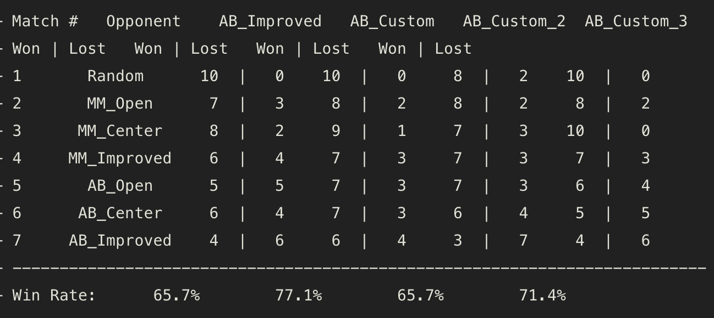

# Heuristic Analysis
In game_agent.py, I implemented three custom_score functions:

1. custom_score(): number of my legal moves minus number of opponent legal moves minus distance from my location to center board.
2. custom_score_2(): the square of distance from my location to opponent location.
3. custom_score_3(): number of my legal moves minus 1.5 times of number of opponent legal moves.

The result shows in the picture:

From the result we can see all of my custom score functions performing not worse than AB_Improved agent. The custom_score_2() has the same win rate with AB_Improved agent, which is 65.7%. The custom_score_3() has 71.4% win rate, which is better than AB_Improved agent. And custom_score() performs best, which is 77.1%.

I recommend custom_score(). First of all, it passes the test and has the best win rate. Second, it wins more games than all of seven tournament agents which indicates that it performs stable. And finally this evaluation function considers more features of a game state, which performs better reasonably.

