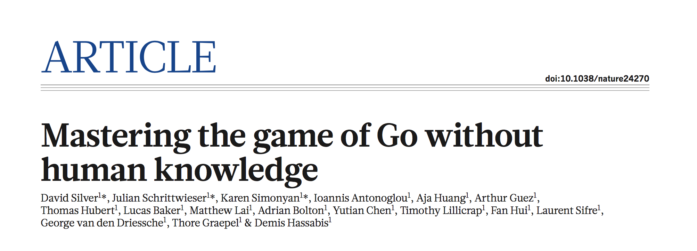

# Research Review of "Mastering the game of Go without human knowledge"

[Mastering the game of Go without human knowledge](https://deepmind.com/documents/119/agz_unformatted_nature.pdf)

## Summary
Recently, AlphaGo became the first program to defeat a world champion in the game of Go. The version AlphaGo Lee beat world champion Lee Sedol in 4 out of 5 games in 2015. The version AlphaGo Master defeated 60 top professionals online and world champion Ke Jie in 3 out of 3 games in 2017. The AlphaGo program using deep neural networks to implement tree search to evaluated positions and selected moves. The versions of AlphaGo mentioned above train deep neural networks by supervised learning from human expert moves, and by reinforcement learning from self-play. But this article introduces an algorithm only rely on reinforcement learning and implements the new program AlphaGo Zero. It use only one deep neural network to predict AlphaGo's own move selections and also the winner of AlphaGo's games. When training the deep neural network, AlphaGo Zero doesn't need human data, guidance or domain knowledge beyond game rules. It only uses the black and white stones from the board as input features and start from random play. These new technology and idea improves the strength of the tree search, resulting in higher quality move selection and stronger self-play in the next iteration, and have a better performance.

## Key Result
When start training, AlphaGo Zero has no prior knowledge of the game and only the basic rules as an input and has completely random behaviour. At 3 days training, AlphaGo Zero surpasses the abilities of AlphaGO Lee. At 21 days training, AlphaGo Zero reaches the level of AlphaGo Master and at 40 days, AlphaGo Zero surpasses all other versions of AlphaGo and, arguably, becomes the best Go player in the world. The result shows in the picture:

Over the course of training, 29 million games of self-play were generated. After fully trained, the author evaluated AlphaGo Zero using an internal tournament against several previous Go programs. The performance of AlphaGo Zero on an Elo scale achieved a rating of 5185, compared to 4,858 for AlphaGo Master, 3,739 for AlphaGo Lee and 3,144 for AlphaGo Fan. And finally, they evaluated AlphaGo Zero head to head against AlphaGo Master in a 100-­game match with 2-­h time controls. AlphaGo Zero won by 89 games to 11. 

The results comprehensively demonstrate that a pure reinforcement learning approach is fully feasible, even in the most challenging of domains: it is possible to train to superhuman level, without human examples or guidance, given no knowledge of the domain beyond basic rules. And a pure reinforcement learning approach requires just a few more hours to train, and achieves much better asymptotic performance, compared to training on human expert data. Using this approach, AlphaGo Zero defeated the strongest previous versions of AlphaGo, which were trained from human data using handcrafted fea­tures, by a large margin.

